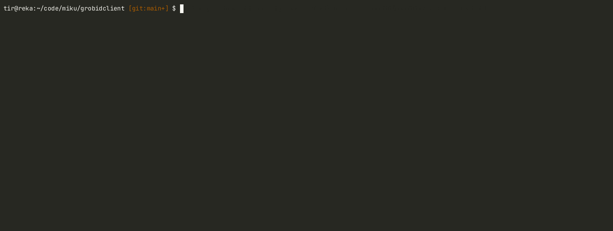

# grobidclient

Go client library and CLI for [grobid](https://github.com/kermitt2/grobid).
**This is not fully functional yet.** To install the CLI:

```
$ go install github.com/miku/grodidclient/cmd/grobidcli@latest
```



## Notes on server setup

* [Production Grobid Server Configuration](https://github.com/kermitt2/grobid/issues/443#issuecomment-505208132)

## Usage

```shell
$ grobidcli -h

░░      ░░░       ░░░░      ░░░       ░░░        ░░       ░░░░      ░░░  ░░░░░░░░        ░
▒  ▒▒▒▒▒▒▒▒  ▒▒▒▒  ▒▒  ▒▒▒▒  ▒▒  ▒▒▒▒  ▒▒▒▒▒  ▒▒▒▒▒  ▒▒▒▒  ▒▒  ▒▒▒▒  ▒▒  ▒▒▒▒▒▒▒▒▒▒▒  ▒▒▒▒
▓  ▓▓▓   ▓▓       ▓▓▓  ▓▓▓▓  ▓▓       ▓▓▓▓▓▓  ▓▓▓▓▓  ▓▓▓▓  ▓▓  ▓▓▓▓▓▓▓▓  ▓▓▓▓▓▓▓▓▓▓▓  ▓▓▓▓
█  ████  ██  ███  ███  ████  ██  ████  █████  █████  ████  ██  ████  ██  ███████████  ████
██      ███  ████  ███      ███       ███        ██       ████      ███        ██        █

valid service names:

  processFulltextDocument
  processHeaderDocument
  processReferences
  processCitationList
  processCitationPatentST36
  processCitationPatentPDF

  -H    use sha1 of file contents as the filename
  -O string
        output directory to write parsed files to
  -P    do a ping
  -S string
        server URL (default "http://localhost:8070")
  -T duration
        client timeout (default 1m0s)
  -c string
        path to config file, often config.json
  -cc
        consolidate citations
  -ch
        consolidate header
  -d string
        input directory to scan for PDF, txt, or XML files
  -f string
        single input file to process
  -force
        force reprocess
  -gi
        generate ids
  -ira
        include raw affiliations
  -irc
        include raw citations
  -n int
        number of concurrent workers (default 4)
  -r int
        max retries (default 10)
  -s string
        a valid service name (default "processFulltextDocument")
  -ss
        segment sentences
  -tei
        add pdf coordinates
  -v    be verbose
  -version
        show version
```

Process a single PDF.

```xml
$ grobidcli -f fixtures/062RoisinAronAmericanNaturalist03.pdf | xmllint --format - | head -10
<?xml version="1.0" encoding="UTF-8"?>
<TEI xmlns="http://www.tei-c.org/ns/1.0" xmlns:xsi="http://www.w3.org/2001/XML...
        <teiHeader xml:lang="en">
                <fileDesc>
                        <titleStmt>
                                <title level="a" type="main">Split Sex Ratios ...
                                <funder ref="#_ZXgvsGF">
                                        <orgName type="full">Belgian National ...
                                </funder>
                        </titleStmt>

...
```

Process pdf files in a directory in parallel.

```shell
$ grobidcli -d fixtures
2024/07/30 20:48:35 scanning fixtures/
2024/07/30 20:48:37 got result [200]: fixtures/62-Article Text-140-1-10-20190621.pdf
2024/07/30 20:48:39 got result [200]: fixtures/062RoisinAronAmericanNaturalist03.pdf
```

Results are not written to a ".grobid.tei.xml" file yet.
